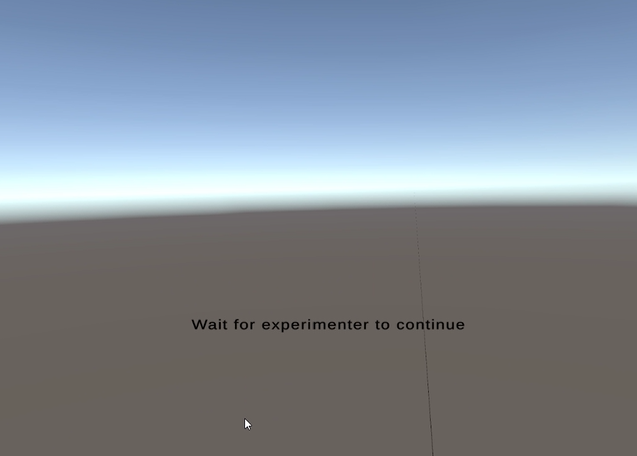
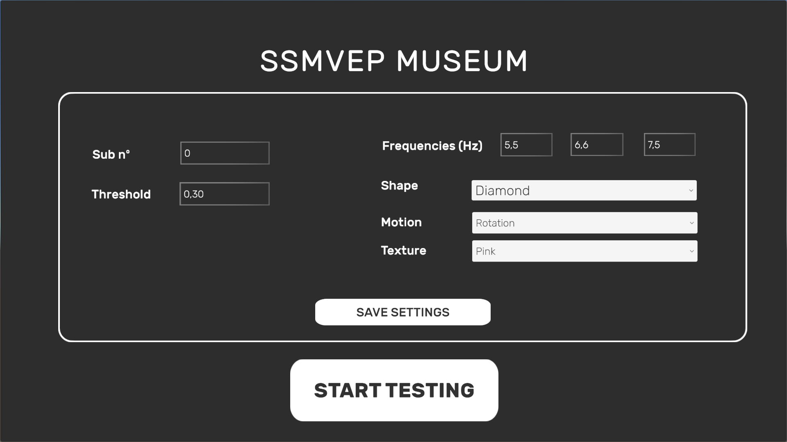
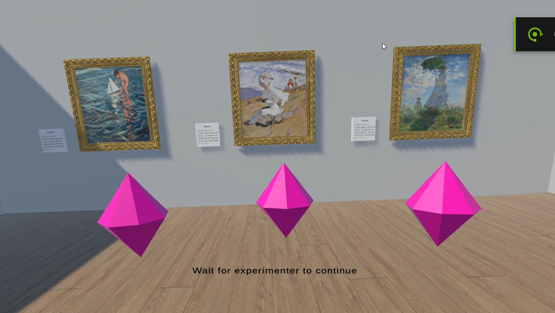
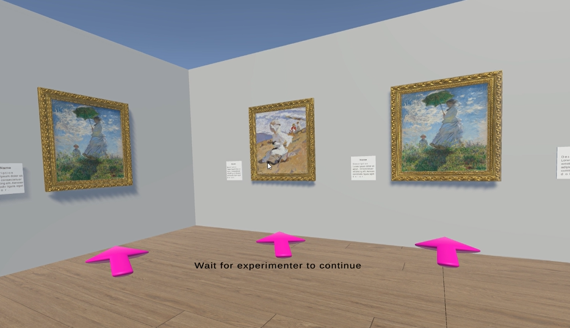
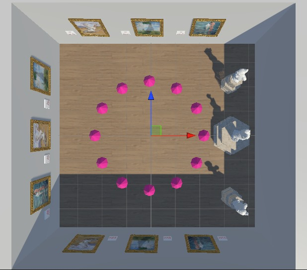
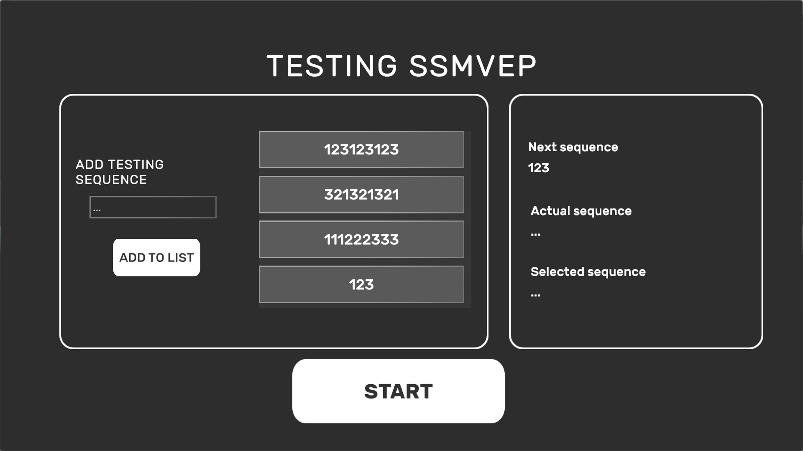
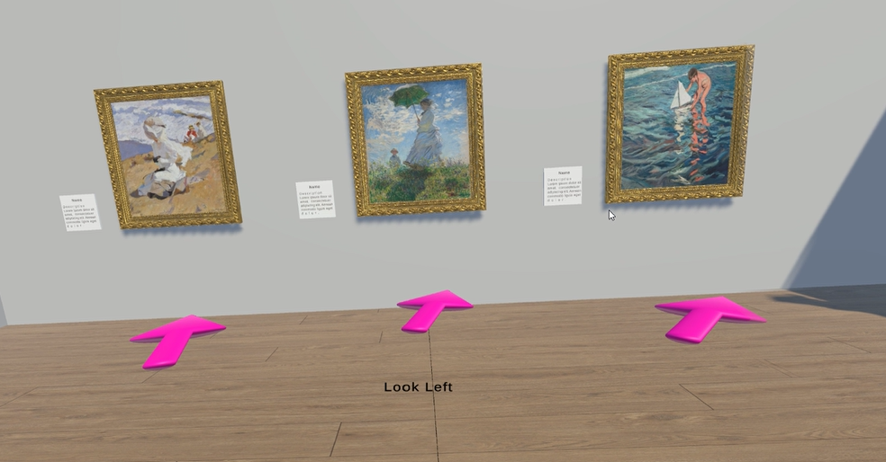
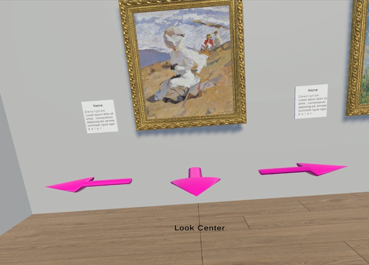

# VR-Based BCI Navigation Game (SSMVEP)

This project implements a VR-based Brain-Computer Interface (BCI) using Unity, g.tec amplifiers, and the Lab Streaming Layer (LSL) framework. The system presents Steady State Motion Visual Evoked Potentials (SSMVEP) stimuli in a VR Museum environment and processes EEG responses for real-time interaction and navigation.

## Table of Contents
1. [Requirements](#requirements)
2. [Installation and Setup](#installation-and-setup)
    - [How to Download the Project](#how-to-download-the-project)
    - [How to Run the Project](#how-to-run-the-project)
    - [How to perform experiments with this project](#how-to-perform-experiments-with-this-project)
4. [Runtime Overview](#runtime-overview)
5. [Testing without EEG Headset](#testing-without-eeg-headset)
6. [Authors](#authors)

## Requirements

- **Vive Pro Headset**: VR Headset accepting SteamVR (note that this project won't work with Oculus Headsets)
- **Unity**: Version `6000.0.31f1`
- **Python**: 3.8+ (for classifier script)
- **SteamVR**: to connect to the Vive Pro HMD
- **Git** (to clone the project)
- **g.tec amplifier** with **gUSBampLSL** software and config files [Download here](https://github.com/labstreaminglayer/App-g.Tec/tree/master/g.USBamp)
- **LabRecorder** for LSL Streaming [Download here](https://github.com/labstreaminglayer/App-LabRecorder)
- **BrainVision LSL Viewer** to check that it's properly recording [Download here](https://www.brainproducts.com/downloads/more-software/)
- **Git LFS** (for large binary files)

## Installation and Setup
### How to Download the Project

1. Clone the repository:
    ```bash
    git clone https://github.com/MamenCortes/VEP-BCI
    ```
2. Open the proyect from the Unity Hub with the Unity version 6000.0.31f1

### How to Run the project

1. Download the .zip file **SSMVEP_museum_builds.zip**
2. Uncompress the folder
4. Open SteamVR
3. Execute the ViveVR-Template file

### How to perform experiments with this project

1. Install all the required software [See Requirements](#requirements).
2. Connect the amplifier to the PC.
3. Prepare and set the EEG Cap. After the impedance of the electrodes is below 5000, the participant will be prepared. 
4. Execute the **gUSBampLSL.exe** file. Before linking `File> Load Configuration> select a .cfg file`.
5. Check that all the electrodes are selected in `File> Edit Configuration`.
6. Click Link.
7. **Open BrainVision LSL Viewer** and click connect. Check if the signals make sense and are recorded correctly. You can double check by asking the participant to bite, move the head, close the eyes, etc. You should observe some artifacts. 
8. Disconnect and close BrainVision Software.
9. Open the **LabRecorder**. Click Update to see the active LSL Streams. You should see the amplifier stream. 
10. Change the location of the files in Study Root, set the participant number and the task at (Block/Task). 
11. With your desired python environment, execute the file `/Assets/Scripts/pythonCCA.py`.
12. Open **SteamVR** and check if the cameras and headset are detected. 
13. Execute the **ViveVR-Template.exe** file.

## Runtime Overview

After launching the Unity project and entering Play mode (or executing the .exe), the application follows a structured runtime flow that connects a VR experience with external EEG classification using the Lab Streaming Layer (LSL). Here's how it works:

### Initial Scene: Waiting Room & Configuration Menu

- **VR User**: Sees an empty skybox with the message:  
  `"Wait for experimenter to continue"`.
  
- **Experimenter (on PC monitor)**:
  - A configuration menu appears allowing selection of:
    - Subject number
    - Classification threshold
    - Stimuli frequencies (by default 5.5Hz, 6.6Hz, 7.5Hz. adjusted for a frame rate of 90Hz)
    - Shape (cube, arrow, diamond)
    - Motion type (rotation or zoom)
    - Texture of the stimuli (pink or blue)
  - After configuring, click **Save settings** and/or **Start**.

### Scene Change: Museum Environment

- The scene transitions to a virtual museum.
- The **LSL Manager** sends all configuration parameters to the Python backend via LSL Outlet.
- **12 stimuli** objects are created around the player in a dodecagon layout (same distance from the player).
  - Only **3 stimuli** are visible at a time in the VR headset (field of view).
- The stimuli are stationary at first - they **do not move** until the test starts.

### Experiment Setup: Testing Menu (PC Only)

- The experimenter sees a second menu with options to:
  - Define testing **sequences** (i.e., desired classification paths).
  - Choose which sequence to run.
  - These sequences contain target direction numbers (1, 2, or 3) that will be compared with classified results to evaluate **accuracy**.
  - The numbers 1,2,3 match to the selected frequencies 5.5Hz, 6.6Hz and 7.5Hz respectively. 

### Test Start & Runtime Loop

1. The experimenter clicks **Start Sequence**.
2. A `startStimulation` marker is sent through the LSL stream.
3. The **Python classifier** begins processing incoming EEG data.
4. The **stimuli start moving** (zoom or rotate based on settings).
5. The system **waits for a classification** (In general 1 = right, 2 = center, 3 = left).
6. The participant is able to turn around and choose a wall to go, but only seeing 3 stimuli at the same time. 
7. The stimuli frequencies are configured in order so that wherever the participant looks, the 3 stimuli always move at different frequencies. 
8. The direction in which the participant must look to select a specific class (1, 2, or 3) is dynamically calculated at runtime. This direction is shown to the participant as a text prompt in front of them: "Look left", "Look right", or "Look center".
- For example, classification target 1 will not always correspond to "right." If the participant is currently facing a group of stimuli arranged in the order (2-3-1) (from left to right), then selecting class 1 would require looking to the right.
In a different arrangement like (1-2-3), selecting class 1 would mean looking left.
- This dynamic cueing ensures that instructions always reflect the current visual layout, making it intuitive for participants to follow the intended direction based on the stimulus arrangement in their field of view.
9. Once classification is received:
   - Movement **stops**.
   - The player is moved to a new location depending on their current location:
    - If the player is in the center of the room -> (GameState: CenterStimuliOn): 
     - **Forward** toward a selected picture.
     - 3 new stimuli appear in front of the picture.
    - If the player is in front of one picture -> (GameState: OuterStimuliOn): 
     - **Backward** towards the center of the room.
     - Or **left/right** between picture groups.
7. The process repeats:
   - Wait 5 seconds.
   - New `startStimulation` marker.
   - Begin classification again.
8. Once the sequence finishes: 
   - The player is moved to the center of the room. 

### Screenshots
*TODO: Add screenshots to images folder*


  
*Fig 1: (**VR-View**) Initial VR waiting screen.*

  
*Fig 2: Experimenter's menu to configure stimuli and parameters.*

  
*Fig 3.1: (**VR-View**) Player in the museum surrounded by diamond stimuli waiting for testing to start.*

 
*Fig 3.2: (**VR-View**) Player in the museum surrounded by arrow stimuli waiting for testing to start.*

 
*Fig 3.3: Top View of 12 stimuli forming a dodecagon around the player located in the center of the room*

  
*Fig 4: Experimenter's menu to configure stimuli and parameters.*

  
*Fig 5: (**VR-View**) Arrow stimuli are moving and classification is running.*

  
*Fig 6: (**VR-View**) Arrow stimuli in front of picture.*

## Testing without EEG Headset
The project can be tested without an EEG headset by simulating the classification outputs pressing the left, right and up arrows during runtime. In order for them to work, the game should be in testing mode. That is, a sequence must have been selected and the button start pressed. 
- Left --> classification 1
- Up --> classification 2
- Right --> classification 3

## Authors
This project was developed as part of an ongoing research at the BCI Lab Kleve by María del Carmen Cortés, who implemented the entire Unity-based VR system and experiment logic, and Hanneke Scheppink, who contributed the Python classification code and data processing pipeline using LSL.

**María del Carmen Cortés** - Student Assistant, BCI Lab Kleve, Hochschule Rhein-Waal:
*Unity project development, VR integration, stimuli design, LSL integration in Unity, and experiment flow.*  
[LinkedIn](https://www.linkedin.com/in/mamen-cortes-navarro/)


**Hanneke Scheppink** - PhD Student, BCI Lab Kleve, Hochschule Rhein-Waal:
 *Python-based classification pipeline, LSL integration in Python.*
[LinkedIn](https://www.linkedin.com/in/hanneke-scheppink/)
